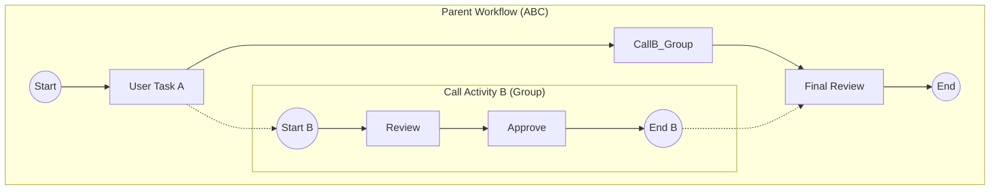

# AB. Global Process Map (Nested Flow Visualization)

## User Story
**As a** Business Analyst or Auditor,
**I want to** view a "Global Process Map" that displays the complete, end-to-end flow of a workflow, including all its nested sub-processes (Child Workflows) expanded in a single diagram,
**So that** I can understand the full lifecycle of a case without navigating through multiple disconnected screens.

## Rationale
Currently, users can only view one workflow definition at a time. If Workflow A calls Workflow B, the diagram for A just shows a "Call Activity" box. To see what happens inside B, the user has to leave A and open B. This fragmentation makes it difficult to audit complex, multi-layered processes (e.g., A -> B -> C).

## Visualization Concept

The goal is to Create a **Flattened Hierarchical Graph**:
1.  **Parent Workflow** is the main container.
2.  **Call Activities** are visually represented as **Groups (SubFlows)** containing the actual nodes of the Child Workflow.
3.  **Edges** connect the Parent's flow to the Child's Start Event, and the Child's End Event back to the Parent's flow.



## Functional Requirements

### 1. Recursive Graph Generation (Backend)
The backend must provide an API that returns a **Single Graph Object** containing nodes and edges for the root workflow and all its descendants.

*   **Endpoint**: `GET /api/workflows/{rootCode}/global-graph`
*   **Logic**:
    *   Fetch Root Workflow.
    *   Identify all `CallActivity` stages.
    *   For each Call Activity, fetch the Child Workflow Definition.
    *   Recursively repeat until no more Call Activities are found (or max depth reached to prevent infinite loops).
    *   **Node ID Strategy**: To prevent collisions (e.g., if A calls B twice, or both A and B use "Start"), node IDs must be namespaced by their path.
        *   Example: `root:stageA` vs `root:callB:childStageA`.

### 2. Frontend Visualization
*   **Technology**: ReactFlow (supporting SubFlows/Group Nodes).
*   **Layout**: Calculated automatically (e.g., Dagre or Elkjs) to handle the nested hierarchy.
*   **Visual Logic**:
    *   **Group Node**: Represents the boundary of the Child Workflow. Labeled with the Child Workflow Name.
    *   **Inter-Level Edges**: 
        *   From Parent Node (Pre-Call) -> Child Start Node.
        *   From Child End Node -> Parent Node (Post-Call).

## Data Structure (GraphDTO)
```json
{
  "nodes": [
    { "id": "A_Start", "label": "Start", "type": "start", "parentId": "group_Root" },
    { "id": "A_CallB", "label": "Call B", "type": "group", "parentId": "group_Root" },
    { "id": "B_Start", "label": "Start B", "type": "start", "parentId": "A_CallB" },
    { "id": "B_Task", "label": "Do Work", "type": "userTask", "parentId": "A_CallB" }
  ],
  "edges": [
    { "source": "A_Start", "target": "A_CallB" },
    { "source": "A_CallB", "target": "B_Start", "type": "implicit_link" }
  ]
}
```

## Acceptance Criteria
- [ ] **API** returns a full JSON graph for a multi-level workflow (A -> B -> C).
- [ ] **Cycle Detection**: If A calls B, and B calls A, the graph generation stops at the recurrence (showing a "Cycle Detected" node) instead of crashing.
- [ ] **Visualizer**:
    - [ ] Displays the Nested Workflow *inside* the Parent flow.
    - [ ] Allows collapsing/expanding groups (Nice to have).
    - [ ] Distinct styling for "Child" nodes to differentiate them from "Root" nodes.
