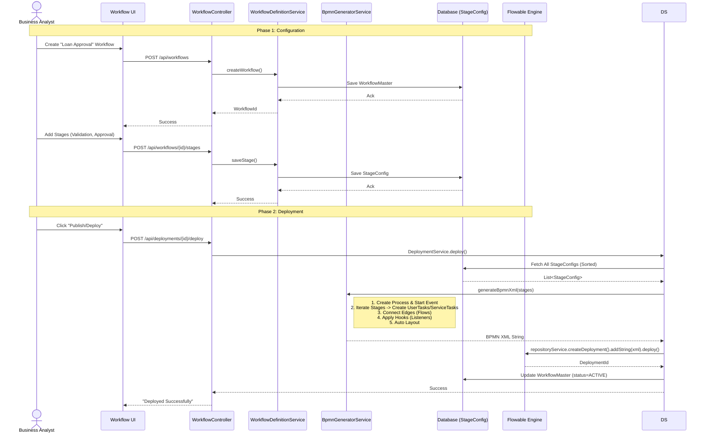
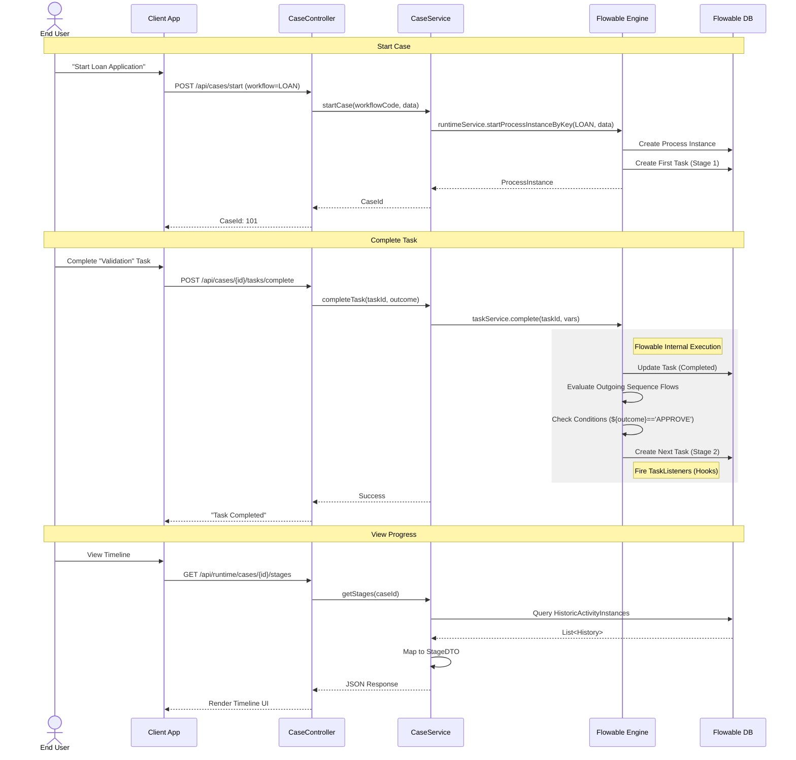

# Workflow Service Sequence Diagrams

## 1. Workflow Definition & Deployment
This flow illustrates how a user creates a new workflow configuration, adds stages, and deploys it to the Flowable Engine.

## 2. Case Initiation & Execution
This flow shows how a new Case (Process Instance) is started and how tasks are completed.

