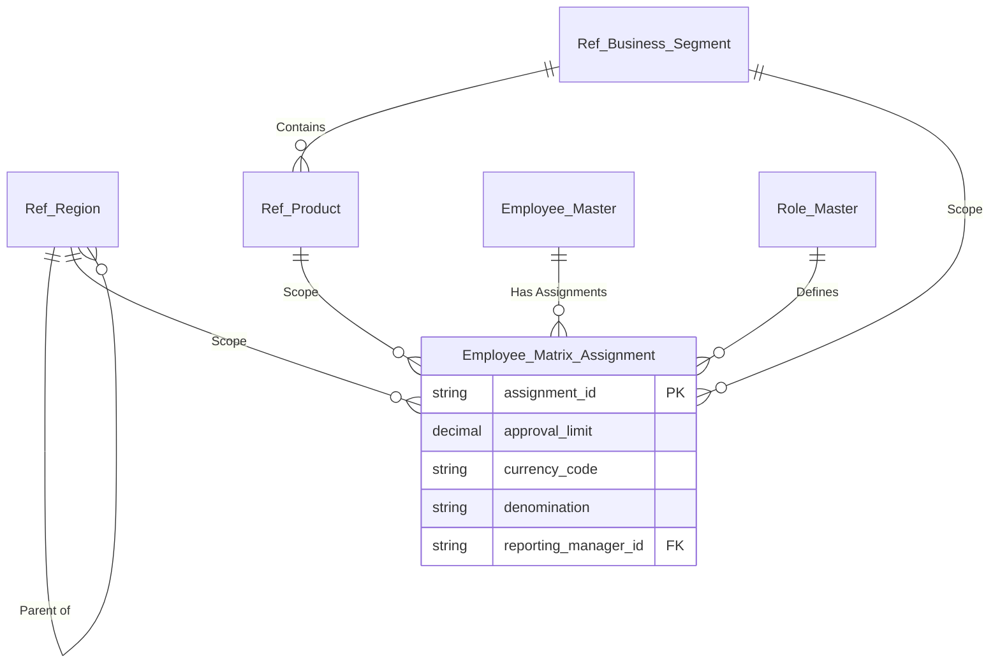

# HRMS & Matrix Organization Data Model Design

## 1. Executive Summary
To support a complex, global organization with overlapping dimensions (Region, Business Unit, Product), a flat "User Table" is insufficient.
We need a **Dimensional Matrix Model**.

**Core Concept**: An Employee is not just "A Manager". They are "A Manager" *for* "Retail Banking" *in* "North Region" *for* "Home Loans".
This design decouples **Who** (Person) from **What** (Function) and **Where** (Scope).

---

## 2. Core Reference Dimensions

### Table 1: `Ref_Region` (Hierarchical)
Manages the geographical structure down to the lowest level (Branch).
*   **Columns**:
    *   `region_id` (PK)
    *   `region_name` (e.g., "Nariman Point Branch")
    *   `region_type` (Enum: GLOBAL, CONTINENT, COUNTRY, STATE, CITY, **BRANCH**)
    *   `pincode` (String) - *Applicable when type is BRANCH.*
    *   `parent_region_id` (FK to Ref_Region) - *Allows traversal up/down the tree.*
    *   `path` (Materialized Path) - *See explanation below.*

### 2.1 Concept Deep Dive: The "Path" and "Multi-Region"

**A. The Materialized Path (Performance Secret)**
Instead of joining the table to itself 10 times to find out if "Branch A" is in "Asia", we store the full lineage as a string.
*   **Example Store**:
    *   Global (ID: 1) -> Path: `/1/`
    *   Asia (ID: 5) -> Path: `/1/5/`
    *   India (ID: 20) -> Path: `/1/5/20/`
    *   Mumbai (ID: 50) -> Path: `/1/5/20/50/`
    *   **Nariman Point Branch** (ID: 99) -> Path: `/1/5/20/50/99/`

*   **The Query**: "Find all branches in Asia (ID: 5)":
    ```sql
    SELECT * FROM Ref_Region WHERE path LIKE '/1/5/%'
    ```
    *Result*: Instantly returns India, Mumbai, and Nariman Point Branch. No recursion needed.

**B. Handling Multiple Continents (The "Disjoint Scope" Problem)**
*Scenario*: User "Alice" manages **Europe** AND **India** (but not the rest of Asia).
*   **Solution**: Do **NOT** try to create a "Fake Region" linking Europe and India. That breaks the geography.
*   **Implementation**: Use the `Employee_Matrix_Assignment` table (Table 6).
    *   Row 1: Alice -> Scope: **Europe** (ID 30)
    *   Row 2: Alice -> Scope: **India** (ID 20)
*   **Logic**: The system checks: *"Is the target transaction in EITHER Europe OR India?"* -> Yes -> Alice is the approver.

### Table 2: `Ref_Business_Segment`
Vertical lines of business.
*   **Columns**:
    *   `segment_id` (PK)
    *   `segment_name` (e.g., "Retail", "Corporate", "SME")
    *   `parent_segment_id` (FK) - *Optional, if you have sub-LOBs.*

### Table 3: `Ref_Product`
Specific products associated with business segments.
*   **Columns**:
    *   `product_id` (PK)
    *   `product_name` (e.g., "Home Loan", "Overdraft")
    *   `segment_id` (FK) - *Links Product to Business Segment.*

---

## 3. Core Identity & Role

### Table 4: `Employee_Master`
 The "Person" entity. Contains only static HR data.
*   **Columns**:
    *   `employee_id` (PK)
    *   `full_name`
    *   `email`
    *   `status` (Active/Terminated)
    *   `base_location_id` (FK to Ref_Region) - *Physical seating location.*

### Table 5: `Role_Master`
Functional definitions, not people.
*   **Columns**:
    *   `role_code` (PK) (e.g., "CREDIT_MGR", "SALES_EXEC")
    *   `role_name`
    *   `base_authority_limit` (Decimal)
    *   `base_currency` (String, e.g. "USD")

---

## 4. The "Matrix Assignment" (The Connecting Dot)

This is the most critical table. It maps People to Roles within a specific Context.

### Table 6: `Employee_Matrix_Assignment`
*   **Columns**:
    *   `assignment_id` (PK)
    *   `employee_id` (FK)
    *   `role_code` (FK)
    *   `scope_region_id` (FK) - *The region they control (e.g., "North").*
    *   `scope_segment_id` (FK) - *Nullable. If NULL, applies to ALL segments.*
    *   `scope_product_id` (FK) - *Nullable. If NULL, applies to ALL products.*
    *   `reporting_manager_id` (FK) - *Specific supervisor for this assignment.*
    *   `approval_limit` (Decimal) - *Specific limit value.*
    *   `currency_code` (String) - *e.g. "USD", "INR".*
    *   `denomination` (String) - *e.g. "ACTUALS", "LAKHS", "MILLIONS".*

**Why this is powerful:**
1.  **Dual Hats**: Alice can be "Regional Head" for "Retail" (High Limit) AND "Acting Manager" for "SME" (Low Limit). Two rows in this table.
2.  **Inheritance**: If `scope_product_id` is NULL, Alice covers all products in her segment.
3.  **Hierarchy**: Use `Ref_Region.path` to find who covers "Mumbai". You query for anyone assigned to "Mumbai" OR "North India" OR "India".

---

## 5. Connecting to Workflow Service

When the Workflow Service asks the **Adapter**:
*"Who is the Approver for a Home Loan in Mumbai?"*

**The Query Logic (in Adapter):**
1.  **Inputs**: Region="Mumbai", Product="Home Loan".
2.  **Step 1 (Expand Region)**: Find all parents of Mumbai -> [Mumbai, Maharashtra, West Zone, India].
3.  **Step 2 (Expand Product)**: Find segment for Home Loan -> [Retail].
4.  **Step 3 (Query Matrix)**:
    ```sql
    SELECT * FROM Employee_Matrix_Assignment
    WHERE role_code = 'APPROVER'
      AND scope_region_id IN (Mumbai, Maharashtra, West Zone, India)
      AND (scope_product_id = 'Home Loan' OR scope_product_id IS NULL)
      AND (scope_segment_id = 'Retail' OR scope_segment_id IS NULL)
    ORDER BY region_granularity DESC, product_granularity DESC
    LIMIT 1;
    ```
5.  **Result**: It matches the most specific Approver available.

## 6. Summary Schema Diagram (Conceptual)



## 7. Evaluation & Implementation Strategy

### 7.1 Pros & Cons Analysis

| Dimension | Pros | Cons |
| :--- | :--- | :--- |
| **Flexibility** | **High**. Can model "Dual Hats", dotted-line reporting, and granular localized roles (e.g. "Acting Manager") without disrupting the main org chart. | **Complexity**. It moves away from a simple "Tree" structure. writing recursive queries (like "User's inherited limit") requires careful SQL. |
| **Separation** | **Excellent**. "Job Title" (HR data) is separate from "Approval Authority" (Risk data). Promoting a user doesn't automatically grant them $1M authority. | **Sync Overhead**. Requires keeping `Employee_Master` in sync with the source HRIS. |
| **Performance** | **Optimized Read**. The lookup is a single table query (`SELECT FROM Matrix WHERE ...`). We avoid traversing the entire HR tree at runtime. | **Write Heavy**. "Moving a Region" (e.g. splitting APAC) requires updating many rows in the Matrix table. |
| **Maintenance** | **Centralized**. All authority logic lives here, not scattered in code. | **Data Entry**. Requires a good UI. "Excel Import" is deadly here; you need a validator to ensure no overlaps. |

### 7.2 Is this data readily available? (Industry Analysis)

**Q: Do standard Core Banking Systems (CBS) or HRMS have this?**
*   **HRMS (Workday, SuccessFactors)**: **NO**. They excel at the "Reporting Hierarchy" (Who reports to whom) and "Job Codes". They rarely store "Product-Specific Approval Limits" or "Matrix Scopes".
*   **Core Banking (Flexcube, Finacle)**: **PARTIALLY**. They usually have a limit table, but it is often tied to the *System ID*, not the *Employee's Role*. It is rigid.

**Verdict**: The "Matrix Assignment" table described here is typically **MISSING** in standard off-the-shelf software.

### 7.3 How to Build It (The "DOA" Service)
Since you won't find this exact table ready-to-use, organizations build a lightweight **"Delegation of Authority" (DOA) Service**.

1.  **Ingest (Nightly)**: Pull `Ref_Region`, `Employee_Master` from HRIS.
2.  **Enrich (Manual/Admin)**: A dedicated Admin Screen (as designed in `AF_Simplified_Assignement_UI`) where the Risk Team assigns the "Limits" and "Scopes" to the Employees.
3.  **Serve (API)**: The Adapter (from Design AH) queries this DOA Service.

**Recommendation**: Treat this Table (`Employee_Matrix_Assignment`) as a **Custom Microservice Database** owned by your Identity/Risk Team, not the Workflow Team.
