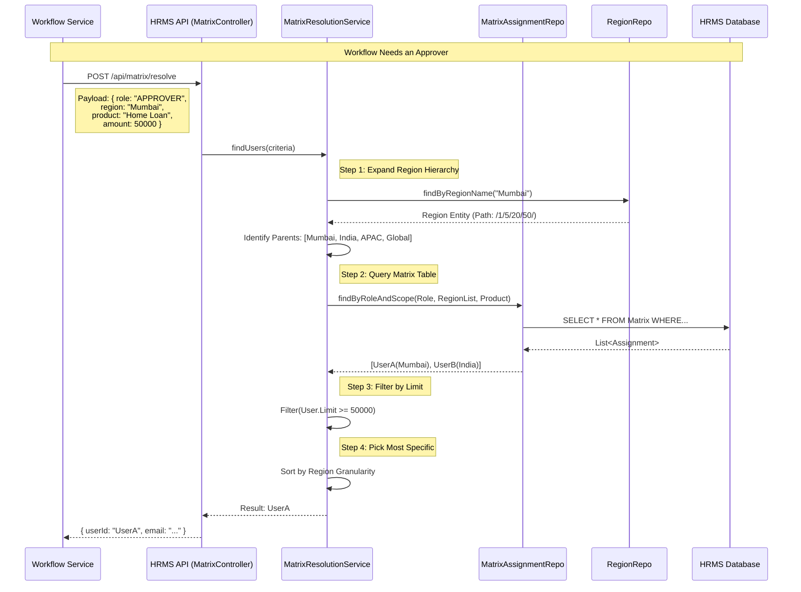
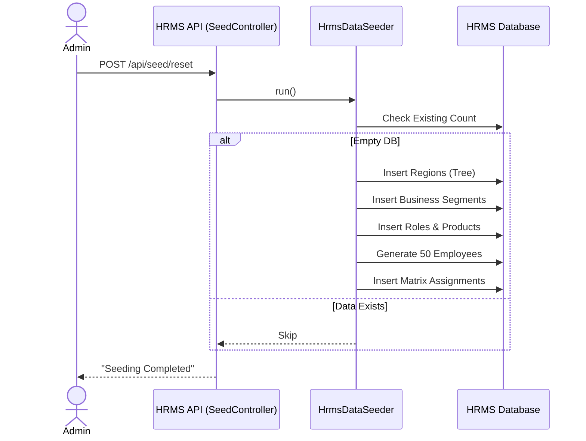

# HRMS Service Sequence Diagrams

## 1. Matrix User Resolution Flow (Runtime)
This flow illustrates how the Workflow Engine (via Adapter) queries the HRMS Service to find the correct user based on Matrix rules (Region, Product, Limit).

## 2. Reference Data Sync (Onboarding)
How data enters the system (Seeding or Sync API).

