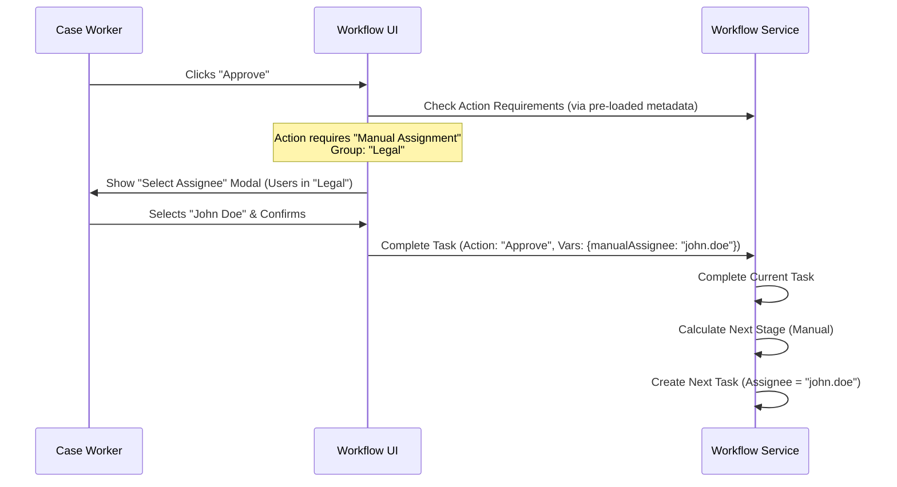

# BB. Manual Assignment Requirement

## 1. Overview
The "Manual Assignment" feature allows the workflow to be configured such that the assignee for a specific stage is chosen manually by the user completing the *previous* stage. This contrasts with automatic assignment methods like Round Robin or simple Group Queues.

When a stage is configured for Manual Assignment, the system presents a user selection interface (dropdown) to the actor of the current task. This actor selects a specific individual from a predefined pool (Group) to handle the next task.

## 2. User Stories

### US-1: Configure Manual Assignment
**As a** Workflow Designer  
**I want to** configure a stage's Assignment Mechanism as "Manual" and specify a "Candidate Group" (e.g., "Legal Team", "Approvers").  
**So that** the specific assignee can be decided at runtime by the person handing off the work, while ensuring the assignee belongs to the correct department.

**Acceptance Criteria:**
- In Stage Configuration > Assignment Tab, a new option "Manual Assignment" is available.
- When "Manual Assignment" is selected, a "Select Group" dropdown is mandatory.
- The configuration is saved as a JSON rule (e.g., `{ "mechanism": "MANUAL", "groupName": "HR_MANAGERS" }`).

### US-2: Select Assignee at Runtime
**As a** Case Worker (Task Owner)  
**I want to** see a "Select Assignee" dropdown when I click an action (e.g., "Approve" or "Pass") that leads to a Manually Assigned stage.  
**So that** I can specifically delegate the next task to the most appropriate person available.

**Acceptance Criteria:**
- The dropdown is populated with users belonging to the configured "Candidate Group".
- I cannot complete the action without selecting a user.
- The selected user becomes the direct assignee of the next task.

## 3. Component Impact Scope

### Backend (`workflow-service`)
- **StageConfig**: Support `MANUAL` mechanism in `assignmentRules`.
- **CaseService**:
  - Logic to detect if the *target* stage of an action requires manual assignment.
  - API to return this "Requirement" metadata (flag + group name) to the frontend as part of `allowedActions` or similar.
- **BpmnGenerator**:
  - Convert `MANUAL` config into a BPMN UserTask that uses a process variable (e.g., `${manualAssignee}`) for the `assignee` field.

### Frontend (`workflow-ui`)
- **Stage Configuration**: Update `AssignmentBuilder` to support the new mode.
- **Case View**:
  - Intercept task completion actions.
  - If the action targets a manual stage, display a Modal with a User Select component (filtered by the config group).
  - Pass the selected User ID as a variable (e.g., `manualAssignee`) when submitting the task completion.

## 4. Flow Diagram

