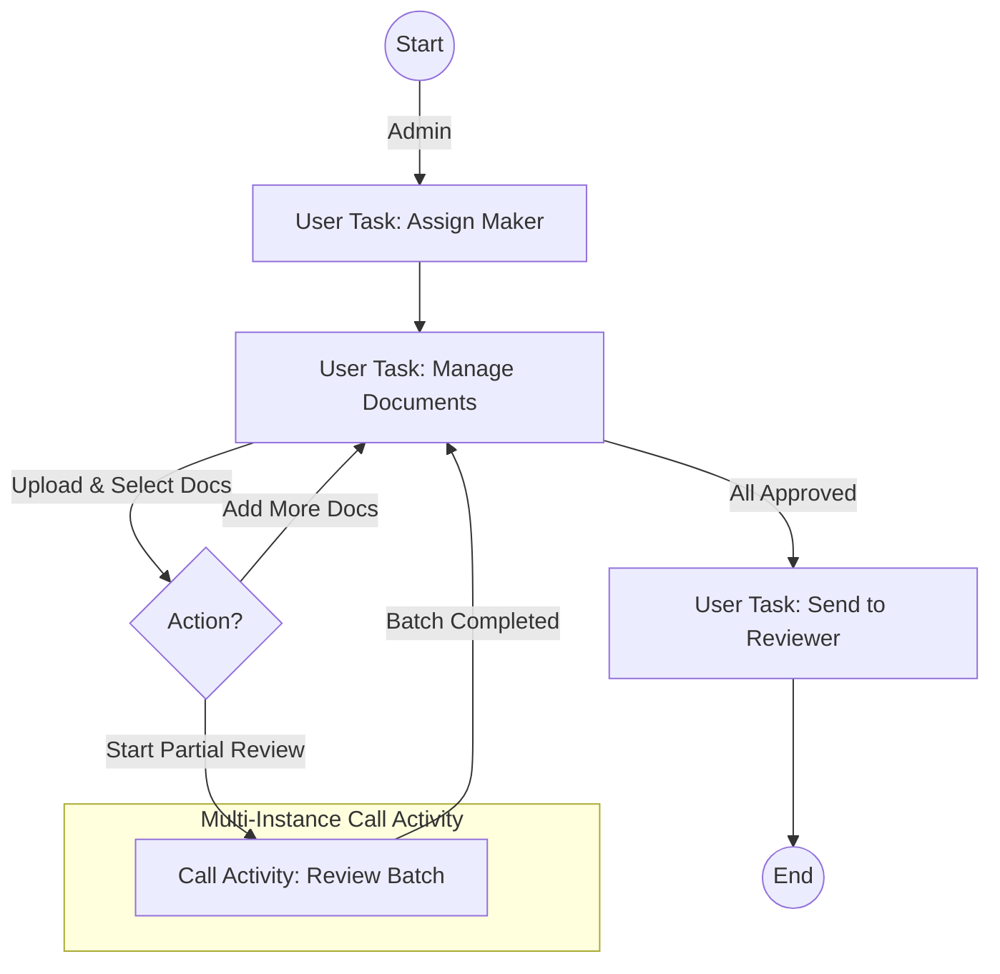
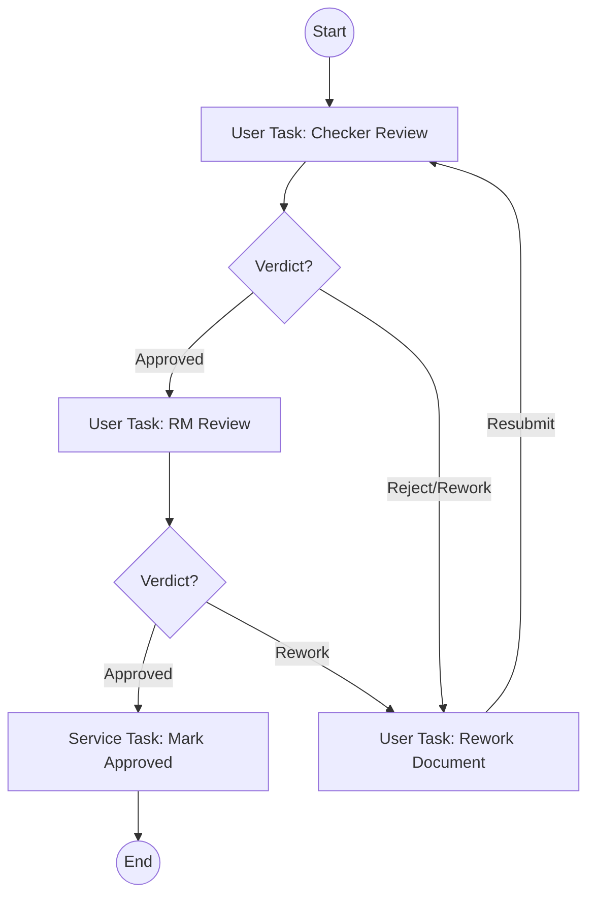

# Document Upload & Review Workflow Design

This document outlines the architectural design and Flowable configuration for a "Document Upload & Review" process. The requirement involves a parent workflow for managing batches of documents and a child workflow for individual document reviews.

## 1. Actors & Roles

| Role | Responsibilities |
| :--- | :--- |
| **ADMIN** | Initiates the case, assigns the Maker, and performs final review dispatch. |
| **MAKER** | Uploads documents, creates batches, and initiates reviews. Handles rework. |
| **CHECKER** | Level 1 Reviewer. Checks document validity. |
| **RELATIONSHIP_MANAGER (RM)** | Level 2 Reviewer. Approves or requests rework. |
| **REVIEWER** | Final recipient of the approved batch (External/Next Step). |

## 2. Process Architecture

To handle "partial batches" and "individual document tracking" efficiently, we will use a **Parent-Child Process Pattern** with **Multi-Instance Call Activities**.

*   **Parent Workflow (`DocBatchWorkflow`)**: Manages the lifecycle of the *Case/Request*. It tracks the overall progress of all documents.
*   **Child Workflow (`DocReviewWorkflow`)**: Manages the lifecycle of a *Single Document*. It handles the specific approval chain (Checker -> RM -> Rework).

---

## 3. Workflow Diagrams & Logic

### A. Parent Workflow (`DocBatchWorkflow`)

**Goal**: Coordinate the upload and batching process.



**Configuration Details:**

1.  **Assign Maker**: Admin selects a user for the `maker` variable.
2.  **Manage Documents (Looping State)**:
    *   This is the main "Dashboard" state for the Maker.
    *   **Data**: The process holds a List/JSON of Documents.
    *   **Actions**:
        *   `Upload`: Adds doc metadata to the list (Status: `UPLOADED`).
        *   `Start Review`: Maker selects a subset of `UPLOADED` or `REWORK` docs.
            *   *Transition*: Moves to `BatchCall`.
            *   *Variable*: Creates a transient list `selectedDocList` containing the IDs/Data of docs to review.
        *   `Submit to Reviewer`: Available only when *All* documents are in `APPROVED` status.
3.  **reviewBatch (Call Activity)**:
    *   **Type**: Call Activity calling `DocReviewWorkflow`.
    *   **Multi-Instance Type**: **Parallel**.
    *   **Collection**: `selectedDocList` (The subset chosen by Maker).
    *   **Element Variable**: `docData` (Individual document object).
    *   **Behavior**: Spawns one child process per selected document. The Parent waits here until *all* selected documents in this partial batch are processed (Approved).
4.  **Loop Back**: After the batch completes, flow returns to `Manage Documents`. The Maker sees the updated status (e.g., 4 `APPROVED`, 6 `UPLOADED`). They can then select the next batch.

### B. Child Workflow (`DocReviewWorkflow`)

**Goal**: Review a single document.



**Configuration Details:**

1.  **Input Variables**: `docData`, `maker`, `admin` (passed from Parent).
2.  **Checker Review**: Assignee: `CHECKER` (or Group).
    *   Outcome: `APPROVE` or `REWORK`.
3.  **RM Review**: Assignee: `RELATIONSHIP_MANAGER`.
    *   Outcome: `APPROVE` or `REWORK`.
4.  **Rework (Maker)**: Assignee: `${maker}`.
    *   Maker updates the document.
5.  **Completion**:
    *   When the process ends (Approved), it triggers a status update.
    *   **Synchronization**: The Parent workflow will resume only when *all* child instances in the current batch (collection) have ended.

---

## 4. Technical Implementation Steps

### Step 1: Data Modeling
Define a JSON structure for the Document List, stored as a process variable `documentList` in the Parent Workflow.
```json
[
  { "id": "doc_1", "name": "Invoice.pdf", "status": "UPLOADED" },
  { "id": "doc_2", "name": "Contract.pdf", "status": "APPROVED" }
]
```

### Step 2: Parent Process Variables
*   `documentList`: The master list of all documents.
*   `subBatchList`: A temporary list created just before the Call Activity, containing only the items to be processed in the current loop iteration.

### Step 3: Configuring the Multi-Instance Call Activity
In Flowable Modeler / XML:
*   **Collection**: `${subBatchList}`
*   **Element Variable**: `docItem`
*   **Called Element**: `doc-review-process`
*   **Multi-Instance**: Parallel
*   **In Parameters**:
    *   Source Expression: `${docItem}` -> Target: `docData`
    *   Source: `${maker}` -> Target: `maker`
    *   Source: `${admin}` -> Target: `admin`
*   **Out Parameters**:
    *   Standard `Out Parameters` might be insufficient if you need to update the status in the `documentList` complex object.
    *   **Recommended Pattern**: Use a **Java Delegate** or **Service Task** at the end of the *Child Workflow* (or an Execution Listener on End Event) to programmatically update the status of the document in the DB or via a helper service. This ensures the "Master View" is always accurate.

### Step 4: UI Logic (Maker Dashboard)
1.  **Render**: Table of documents from `documentList`.
    *   Columns: Name, Status, Actions.
2.  **Action - Upload**:
    *   User uploads file -> Backend saves file -> Returns ID.
    *   Frontend adds `{id, name, status='UPLOADED'}` to `documentList` variable.
3.  **Action - Start Review**:
    *   User selects checkbox for rows (filter: status != APPROVED).
    *   Frontend constructs `subBatchList` with selected items.
    *   Frontend completes "Manage Documents" task with variables: `{ subBatchList: [...], action: "START_REVIEW" }`.
    *   Workflow Gateway routes to Call Activity.

---

## 5. Summary
*   **Flexibility**: Allows processing 4 active, 6 pending, then 3 active, etc.
*   **Isolation**: Rejection of "Document A" doesn't block approval of "Document B".
*   **Tracking**: Parent workflow provides a "Case View" of the entire batch status via the Loop.
