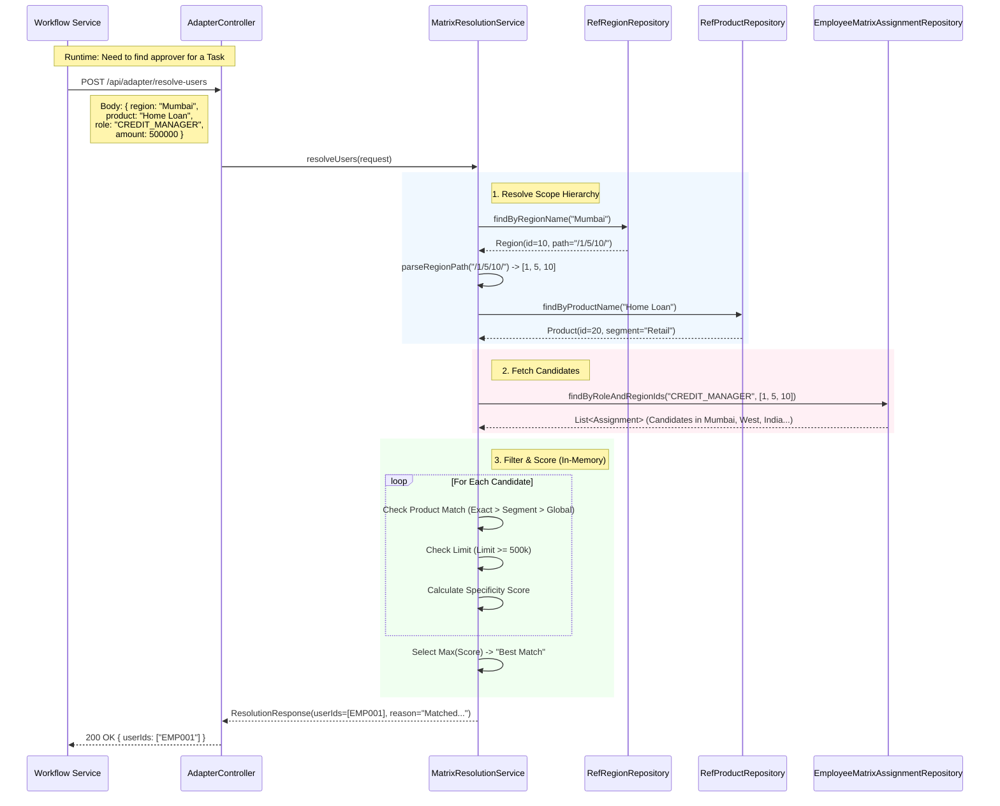
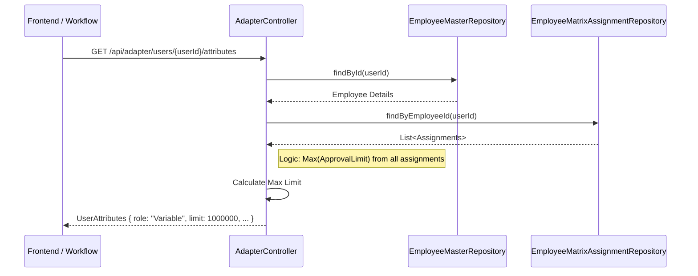

# HRMS Service Explanation

The `hrms-service` is responsible for managing organizational structure (Regions, Products, Roles) and handling the **Matrix Assignment** logic to dynamic resolve approvers for workflows.

## Core Components

1.  **Management API** (`HrmsManagementController`): CRUD operations for setting up the organization matrix.
2.  **Adapter API** (`AdapterController`): External facing API used by the `workflow-service` to resolve users and fetch attributes.
3.  **Resolution Engine** (`MatrixResolutionService`): The core logic that finds the "Best Match" employee based on scope specificity.

## Sequence Diagram: Matrix Resolution Flow

This diagram illustrates how the `workflow-service` interacts with `hrms-service` to find an assignee for a task.

## Sequence Diagram: User Attributes & Limits

This diagram shows how user attributes (including aggregated approval limits) are fetched.

